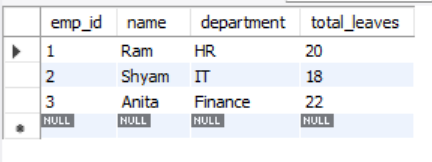
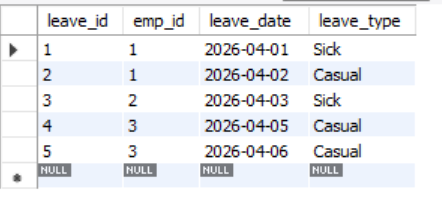
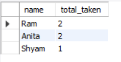
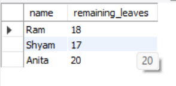
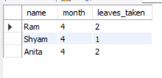

# Employee Leave Management System

##  Problem Statement

Develop a SQL-based system to track employee leaves and generate useful reports such as leave usage, remaining balance, and monthly analysis.

## Features

* Store employee details
* Track leave records
* Calculate total leaves taken
* Identify employees with most leaves
* Calculate remaining leave balance
* Generate monthly leave reports

---

## Technologies Used

* MySQL
* SQL (DDL, DML, Queries)
* Joins, Aggregation Functions

---

## Database Structure

### Employees Table

* `emp_id` → Employee ID
* `name` → Employee Name
* `department` → Department
* `total_leaves` → Total leave entitlement

### Leaves Table

* `leave_id` → Leave ID
* `emp_id` → Employee reference
* `leave_date` → Date of leave
* `leave_type` → Type (Sick/Casual)

---

## How to Run

1. Open MySQL Workbench
2. Run the SQL script step by step:

   * Create database
   * Create tables
   * Insert data
   * Execute queries

---

## Output Screenshots

 
<b>Employees Table</b>

  

 
<b>Leaves Table</b>

  

 
<b>Employees with Most Leaves</b>

  

 
<b>Remaining Leave Balance</b>

  

 
<b>Monthly Leave Report</b>

---
